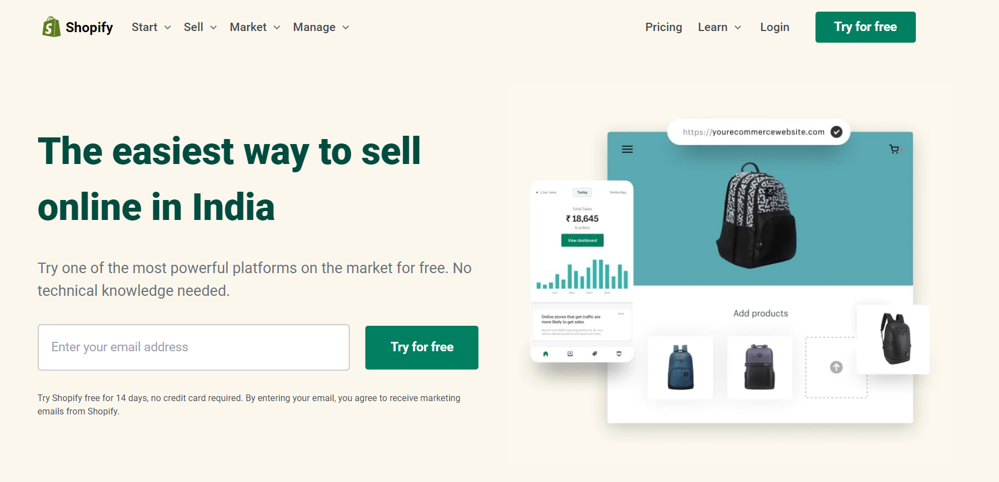

# Telwind CSS Bootcamp Project : Shopify (More Than +500 lines)
**By  Saurabh**

## Shopify UI Clone (FULLY Responsive) [GO LIVE](https://shopify-clone-saurabhp-ineuron.netlify.app/)

---

---
## Technologies used

> HTML

> Tailwind CSS  
---
## **Skill Gained in the project**
- It based on grid and it was my first grid experience learn a lot of things in depth.
- such project literally build confindence.

# Time taken to finish this
- it's Approximately **13 Hour** 

